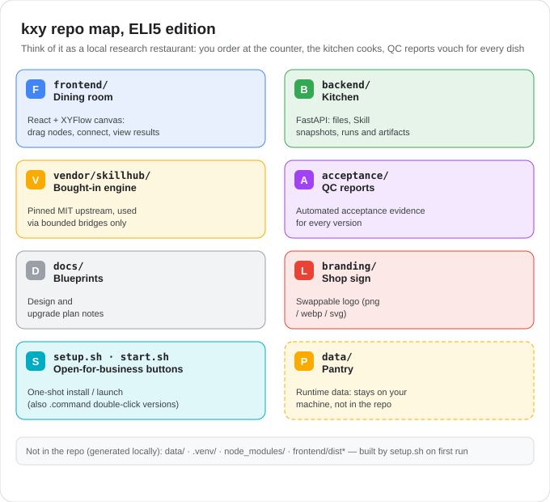

# kxy — Local Research Workflow Canvas

English | [简体中文](./README.md)

kxy is a research workflow canvas that runs entirely on your machine: the React/XYFlow frontend visually edits the native `kxy.workflow.v1` workflow JSON, the FastAPI backend manages files, Skill snapshots, credential references, run snapshots and artifacts, and the runtime is built on the pinned `lfx==1.12.0` Graph API. Agent nodes execute through local CLI subprocesses (Codex, Claude Code, OpenCode, pi, Hermes, WorkBuddy, DeepSeek Harness). kxy does not depend on an external Langflow checkout and never modifies any CLI's global configuration.

Key capabilities: visual canvas with black-box subflows, bounded multi-agent loops (executor + reviewer), human confirmation gates, auditable checkpoint resume, workflow ZIP import/export, cross-agent Skill mounting (SkillHub) and read-only MCP import.



## Quick start

```bash
git clone https://github.com/xieshentoken/kxy-agent-workbench.git
cd kxy-agent-workbench
./setup.sh     # create .venv and install Python dependencies (network needed on first run)
./start.sh     # start the service
```

Then open <http://127.0.0.1:8710/> in your browser.

- Alternatively double-click `Install.command` (install) and `Start.command` (launch).
- Health check: `curl http://127.0.0.1:8710/api/health`
- Port conflict: `KXY_PORT=9000 ./start.sh`
- Rebuild the frontend for development: `./setup.sh --build-frontend` (runs `npm ci` + `npm run build`)
- Typical flow: Settings → Agent config to discover models → connect "materials → analyzer → output container" on the canvas → run.

## Dependencies

| Dependency | When needed | How to install |
|------------|-------------|----------------|
| Python 3.12 | Required | `brew install python@3.12` (or `brew install uv`, or the python.org installer; make sure `python3` points to 3.12) |
| Agent CLIs | To run analyzer nodes | Install and log in to Codex / Claude Code / OpenCode etc. per their official docs; kxy does not install them or bundle login state |
| Node.js 20+ / npm | Only for development / frontend rebuild | `brew install node` |
| MCP servers | Optional | Use "Discover MCP (read config only)" in the UI to import on demand; native global config is never rewritten |

Notes: the setup script prefers `backend/requirements-lock.txt` and falls back to `backend/requirements.txt`. `python3 verify_package.py` (manifest check) is only needed for the ZIP release package; source users can skip it.

## Important notes

- **Platform**: macOS 15+ Apple Silicon (M1 or later) only; the setup script refuses anything else.
- **Network**: the service listens on `127.0.0.1` only; outbound network depends on the chosen CLI / model / MCP.
- **Secrets**: the database and workflow JSON never store secrets; API services are saved as opaque Keychain references. If the UI shows `100001 / Operation not permitted`, macOS has denied Keychain access to a restricted launch environment — run `./start.sh` from Terminal in the project root; it is not an API key error.
- **Data & upgrades**: all run data lives in `data/` (redirectable via `KXY_DATA_ROOT`). To upgrade: stop the service, back up `data/`, rebuild `.venv` in a fresh directory; never move `.venv` across directories.
- **Export sanitization**: workflow ZIP export does not automatically scrub sensitive fields you manually put into attachments or Skill contents — review before sharing. Export limits: ZIP ≤ 100 MB, manifest ≤ 1 MB, workflow ≤ 5 MB.
- **Output authorization**: result folders must be explicitly authorized by you and can be revoked anytime; every run gets its own work directory and output manifest.
- **New device**: you must re-login CLIs, re-authorize output folders and rebuild MCP/API config; Keychain does not migrate with the package.
- **Tests**: scripts in `acceptance/` use synthetic inputs and temp data directories and say nothing about real model quality; real CLI smoke tests are explicit opt-in (`acceptance/real_cli_smoke.py`).

## Further reading

- Third-party dependencies and licenses: [`THIRD_PARTY_NOTICES.md`](./THIRD_PARTY_NOTICES.md), [`THIRD_PARTY_FRONTEND_LICENSES.txt`](./THIRD_PARTY_FRONTEND_LICENSES.txt)
- Vendored skillhub provenance and verification: [`vendor/skillhub/UPSTREAM_PROVENANCE.json`](./vendor/skillhub/UPSTREAM_PROVENANCE.json)
- Design and implementation notes: [`docs/`](./docs/) · Acceptance evidence: [`acceptance/`](./acceptance/)
