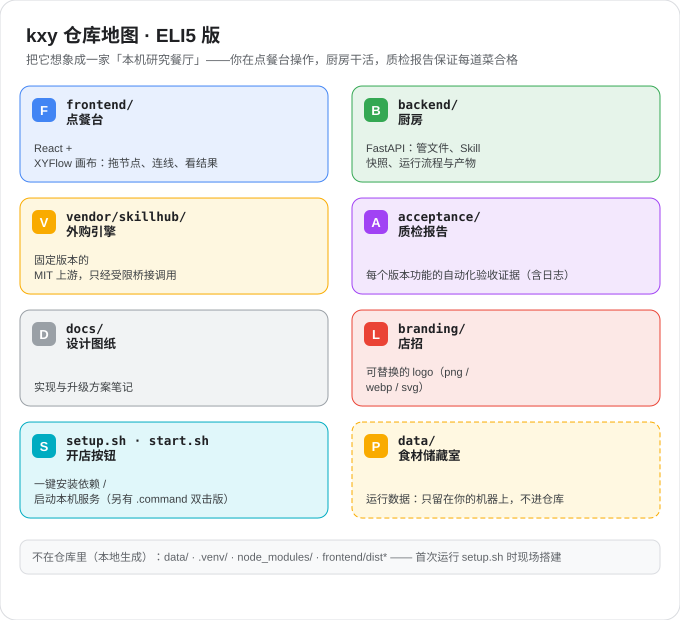

# kxy — 本机研究流程画布

简体中文 | [English](./README.en.md)

kxy 是一个在本机运行的研究流程画布：前端用 React/XYFlow 可视化编辑自有 `kxy.workflow.v1` 工作流，后端用 FastAPI 管理文件、Skill 快照、凭据引用、运行快照与产物；运行时基于固定版本的 `lfx==1.12.0` Graph API，Agent 节点通过本机 CLI 子进程执行（Codex、Claude Code、OpenCode、pi、Hermes、WorkBuddy、DeepSeek Harness）。kxy 不依赖外部 Langflow checkout，也不修改任何 CLI 的全局配置。

核心能力：可视化画布与黑盒子子流程、有界多 Agent 循环（执行器 + 审阅器）、人工确认闸门、可审计的检查点恢复、工作流 ZIP 导入/导出、跨 Agent Skill 挂载（SkillHub）与 MCP 只读导入。



## 快速开始

```bash
git clone https://github.com/xieshentoken/kxy-agent-workbench.git
cd kxy-agent-workbench
./setup.sh     # 创建 .venv 并安装 Python 依赖（首次需联网）
./start.sh     # 启动服务
```

然后浏览器打开 <http://127.0.0.1:8710/>。

- 也可以双击 `Install.command`（安装）和 `Start.command`（启动）。
- 健康检查：`curl http://127.0.0.1:8710/api/health`
- 端口冲突：`KXY_PORT=9000 ./start.sh`
- 源码开发需要重建前端时：`./setup.sh --build-frontend`（执行 `npm ci` + `npm run build`）
- 上手顺序：设置 → Agent 配置里发现模型 → 画布上「资料 → 分析器 → 输出容器」连线 → 运行。

## 依赖安装

| 依赖 | 何时需要 | 安装方式 |
|------|----------|----------|
| Python 3.12 | 必须 | `brew install python@3.12`（或 `brew install uv`，或 python.org 安装包；确保 `python3` 指向 3.12） |
| Agent CLI | 运行分析器节点 | Codex / Claude Code / OpenCode 等按各自官方文档安装并登录；kxy 不代装、不打包登录态 |
| Node.js 20+ / npm | 仅源码开发或重建前端 | `brew install node` |
| MCP servers | 需要时 | 用界面「发现 MCP（仅读取配置）」按需导入，不改写原生全局配置 |

说明：安装脚本优先使用 `backend/requirements-lock.txt`，缺失时回退 `backend/requirements.txt`。发布包模式才需要 `python3 verify_package.py`（校验清单），纯源码使用可跳过。

## 注意事项

- **平台**：仅支持 macOS 15+ Apple Silicon（M1 及以后）；安装脚本会拒绝其他环境。
- **网络**：服务只监听 `127.0.0.1`，不对局域网开放；运行是否需要外网取决于所选 CLI / 模型 / MCP。
- **密钥**：数据库与工作流 JSON 不保存密钥；API 服务以 Keychain 不透明引用保存。若界面提示 `100001 / Operation not permitted`，是 macOS 拒绝了受限启动环境的 Keychain 访问——请在 Terminal 里进入项目根目录执行 `./start.sh`，不是 API key 错误。
- **数据与升级**：运行数据都在 `data/`（可用 `KXY_DATA_ROOT` 重定向）。升级时先停服、备份 `data/`，在新目录重建 `.venv`；不要跨目录搬 `.venv`。
- **导出脱敏**：工作流 ZIP 导出不会自动清理你手动写入附件/Skill 的敏感字段，分享前请先自查。导出上限：ZIP ≤ 100 MB、manifest ≤ 1 MB、workflow ≤ 5 MB。
- **输出授权**：结果保存目录必须由你显式授权，授权可随时撤销；每次运行有独立工作目录与输出清单。
- **换设备**：需重新登录 CLI、重新授权输出目录、重建 MCP/API 配置；Keychain 不随包迁移。
- **测试**：`acceptance/` 中的脚本使用合成输入与临时数据目录，不代表真实模型质量；真实 CLI 冒烟测试是显式 opt-in（`acceptance/real_cli_smoke.py`）。

## 相关文档

- 第三方依赖与许可：[`THIRD_PARTY_NOTICES.md`](./THIRD_PARTY_NOTICES.md)、[`THIRD_PARTY_FRONTEND_LICENSES.txt`](./THIRD_PARTY_FRONTEND_LICENSES.txt)
- vendored skillhub 上游出处与校验：[`vendor/skillhub/UPSTREAM_PROVENANCE.json`](./vendor/skillhub/UPSTREAM_PROVENANCE.json)
- 设计与实现笔记：[`docs/`](./docs/) · 验收证据：[`acceptance/`](./acceptance/)
